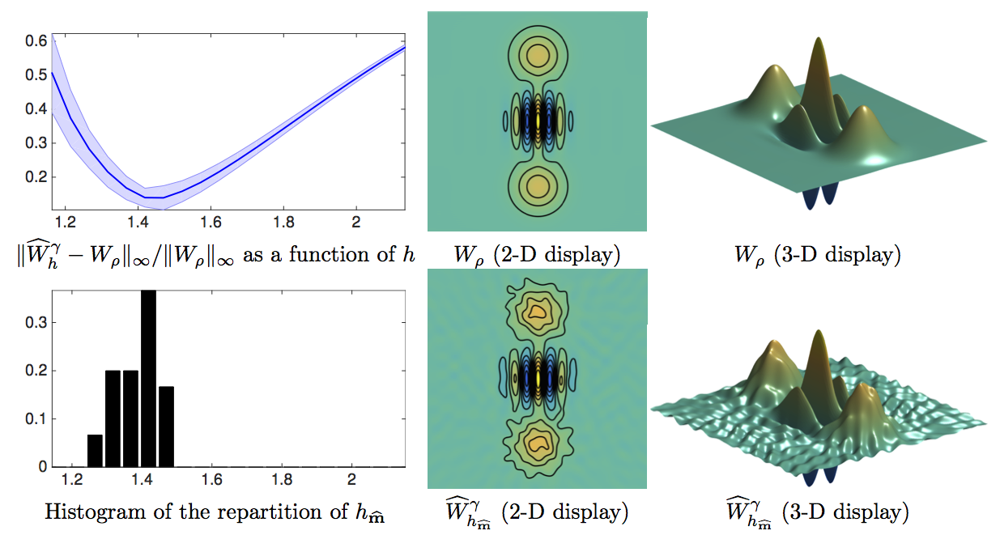

Toolbox to reproduce the numerical results of the paper:

K. Lounici, K. Meziani, G. Peyré. [Minimax and adaptive estimation of the Wigner function in quantum homodyne tomography with noisy data](http://arxiv.org/abs/1506.06941). Preprint Arxiv:1506.06941, 2015.

=====================
Files description

* test_wigner.m : main script that performs sampling, deblurring/denoising and parameter selection.
* compute_rho.m : load rho functions.
* load_deconvolution_operator.m : load the linear estimator.
* load_rho.m : load a Wigner function.
* rho_surf.m : display of a Wigner function.
* perform_radon_sampling.

=====================
Fast Slant Stack Transform

The directory SlantStackP/ contains the implementation of Fast Slant Stack Transform toolbox implementing

    Fast Slant Stack: A notion of Radon Transform for Data in a Cartesian Grid which is Rapidly Computible, Algebraically Exact, Geometrically Faithful and Invertible
    A. Averbuch, R.R. Coifman, D.L. Donoho, M. Israeli, J. Walden

which makes use of the polar FFT detailed in

    Fast and accurate Polar Fourier transform
    A. Averbuch, R.R. Coifman, D.L. Donoho, M. Elad, M. Israeli
    Applied and Computational Harmonic Analysis, Volume 21, Issue 2, September 2006, Pages 145-167

Copyright (c) 2015 Gabriel Peyré
